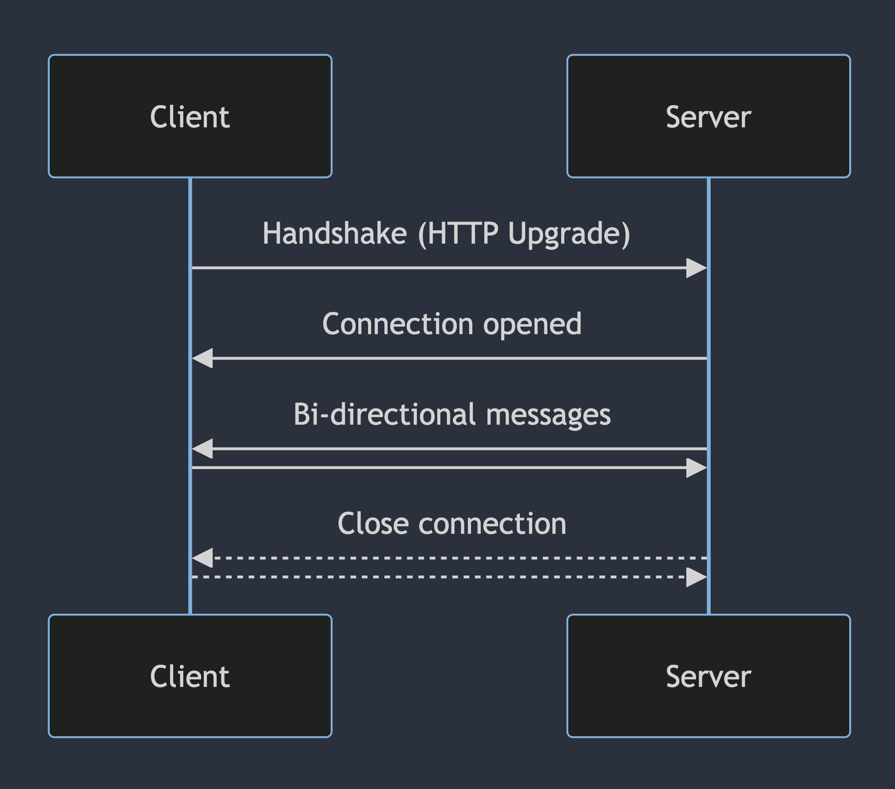

Real-time applications have always fascinated me. The idea that you can connect
people from all over the world in a single web application to chat, edit files,
or play games with near instant feedback is simply amazing. Having very little
experience with what goes into building real-time applications I was interesting
in re-building a key feature of collaboration within Figma: multiplayer cursors.

While this feature may seem relatively simple given the result is just some
cursors that move around on the screen, the implementation requires a
non-trivial amount of code to build. To get started with building our
application, let's first outline the main requirements for the project:

- Low-latency updates between connected users
- Cursors are added when new users connect to the application
- Cursors are removed when users disconnect from the application
- When a user connects, they immediately see all the users who are currently
  connected
- The client automatically reconnects to the server if the connection is
  unexpectedly closed

A very naive approach to this problem would be to use a polling technique where
the client periodically sends it's cursor position to the server and receives
the positions of other connected users. This would result in a great deal of lag
due to the polling delay as well as the time required for each HTTP request.
[WebSockets](https://developer.mozilla.org/en-US/docs/Web/API/WebSockets_API)
are much better suited for this application, but they are more complex to
implement.

Before we can implement WebSockets in our application, we probably should build
the core application itself! We'll get back to WebSockets later in this post, as
that is certainly the most interesting part of this build, but let's get some of
the basics knocked out first.

## Scaffolding the application

This application is very simple, but I'm building it in a way that could fit
easily into an existing React application. Nothing in this is React specific, so
everything could be done with another framework or vanilla HTML and JavaScript.
Checkout the [further reading](#further-reading) section for links to the source
code on GitHub for both this React version as well as other frameworks. The
frameworks and tools I'm using for this application include:

- [Tailwind CSS](https://tailwindcss.com) for styling
- [Vite](https://vitejs.dev) for bundling
- [Bun](https://bun.sh) as the server

Starting at the root of the application, there are two primary components we
need to build: `Cursors` and `Tracker`. The `Cursors` component will be
responsible for showing the cursors of **other** users that are connected and
the `Tracker` component will be responsible for sending updates from **us** to
other users.

```tsx showLineNumbers
function App() {
  return (
    <>
      <Cursors />
      <Tracker />
    </>
  )
}
```

### Tracking cursor movement

Let's start with the implementation of `Tracker` as it's the simpler of the two.
This component will need to listen to changes to cursor position and publish
that information to the server so other users can receive the updated cursor
position. We can do this by registering a
[`mousemove`](https://developer.mozilla.org/en-US/docs/Web/API/Element/mousemove_event)
listener inside of a `useEffect` hook.

```ts showLineNumbers
export function Tracker() {
  useEffect(() => {
    function handleMove(event: MouseEvent) {
      console.log(`X:${event.clientX}, Y:${event.clientY}`)
    }

    window.addEventListener("mousemove", handleMove)

    return () => {
      window.removeEventListener("mousemove", handleMove)
    }
  }, [])

  return null
}
```

Now that we are listening to `mousemove` events, you should see logs in the
browser console every time that you move your cursor in the app. This isn't that
useful since that only shows up for us, but it's a great first step. We'll fill
in the rest later in this post after we setup our WebSocket so we can publish
our cursor position to other users.

### Supporting touch devices

Before moving on, let's take a moment to consider mobile devices. While this
code works great for a laptop or desktop computer, if you try to run it on a
phone or tablet, you'll notice that it doesn't print anything to the console.
Mobile devices don't actually fire `mousemove` (or related events) when you
touch or drag your finger around the screen. This is because mouse and touch
interactions are fundamentally different, so they cannot both be represented by
the same event object.

One of the key differences between mouse and touch events is that touch events
can have more than one set of coordinates given that you can touch the screen
with multiple fingers at the same time. You can access each set of coordinates
via the `event.touches` property which is a list of individual touches each of
which contain their coordinates.

For our application, we don't _really_ care if the user is touching the screen
with one finger, or three fingers, in both cases we only want to show a single
cursor to other users. So while there may be more than one touch in
`event.touches`, we can simply use the first touch in the list to track cursor
(or I suppose more properly finger) movement.

```ts showLineNumbers
useEffect(() => {
  function handleMove(event: MouseEvent | TouchEvent) {
    const source = "touches" in event ? event.touches[0] : event

    console.log(`X:${source.clientX}, Y:${source.clientY}`)
  }

  window.addEventListener("mousemove", handleMove)
  window.addEventListener("touchmove", handleTouch)

  return () => {
    window.removeEventListener("mousemove", handleMove)
    window.removeEventListener("touchmove", handleTouch)
  }
}, [socket])
```

### Displaying cursors

To display the cursors of other users, we need to build two new components: a
component which displays a user's cursor on the screen, and a component that
manages all the cursors including adding cursors when users connect and removing
cursors when users disconnect.

For our single `Cursor` component, we want to show both an
[arrow shape](https://github.com/mskelton/cursed/blob/main/src/components/Arrow.tsx)
and the user's name so we know which cursors belong to who. To give our
application a bit of color, I'm using the
[color-hash](https://npm.im/color-hash) package to generate a random color based
on the name of the user. We'll use this color as the background of the arrow and
the user's name.

The position of the cursor is controlled by the
[custom properties](https://developer.mozilla.org/en-US/docs/Web/CSS/Using_CSS_custom_properties)
`--x` and `--y` which are used to translate the cursor from it's fixed position
on the page. The use of
[viewport units](https://developer.mozilla.org/en-US/docs/Learn/CSS/Building_blocks/Values_and_units)
(`vw` and `vh`) allows us to express the coordinates of each cursor as a
percentage of the page width/height, rather than a fixed offset. This is
important as each user who visits our application may have different screen
sizes, but the positions of each cursor should match the relative position on
the source device.

The `Cursor` component also uses
[forwardRef](https://react.dev/reference/react/forwardRef) which we'll need
later when updating cursor position from incoming WebSocket messages.

```tsx showLineNumbers
interface CursorProps {
  connection: ClientConnection
}

export const Cursor = forwardRef<HTMLDivElement, CursorProps>(function Cursor(
  { connection },
  ref,
) {
  const hash = new ColorHash({ lightness: 0.3 })
  const color = hash(connection.user.name)

  return (
    <div
      ref={ref}
      className={clsx(
        "fixed flex translate-x-[--x] translate-y-[--y] gap-1 rounded text-xs",
        // If we don't have any initial coordinates for the user, hide this
        // cursor. This happens when a new client first connects.
        connection.coords.x ? "visible" : "invisible",
      )}
      style={
        {
          "--x": `${connection.coords.x}vw`,
          "--y": `${connection.coords.y}vh`,
        } as React.CSSProperties
      }
    >
      <Arrow color={color} />

      <span
        className="relative -left-1.5 top-4 rounded-sm px-1.5 py-0.5 text-white"
        style={{ backgroundColor: color }}
      >
        {connection.user.name}
      </span>
    </div>
  )
})
```

Now that we can display a single cursor, it's time to display them all! Let's
create a `Cursors` component which will display a single `Cursor` for all
connected users. For reasons we'll see later, we want to store the cursors as an
object with the keys representing a user's connection id (more on that later),
and the value representing information about the user's connection such as their
name, last known coordinates, and a
[React ref](https://react.dev/learn/manipulating-the-dom-with-refs) that we will
use later to update cursor position on the fly.

We can use `Object.values` to get a list of connections when can then map
through and render the individual `Cursor` components. We can see now why the
`Cursor` component needed to use `forwardRef` as we are passing the ref stored
in our connection object to the cursor to allow updating it's position on the
fly. Once again, more on this later in the post!

```tsx showLineNumbers
export function Cursors() {
  const [cursors, setCursors] = useState<Record<string, ClientConnection>>({})

  return (
    <>
      {Object.values(cursors).map((connection) => (
        <Cursor
          key={connection.id}
          ref={connection.ref}
          connection={connection}
        />
      ))}
    </>
  )
}
```

## Introduction to WebSockets

At this point, the scaffolding for our project is setup, and we can now begin
the work of connecting users via WebSockets. While there are many great
WebSocket libraries such as [socket.io](https://socket.io), in this application
we are going to setup our WebSocket from scratch to better understand how
WebSockets work and the low-level APIs the browser provides for using them.
However, before we can implement our first WebSocket, let's take a step back and
understand how WebSockets actually work.

WebSockets are persistent HTTP connections that allow bi-directional
communication between the client and server. By maintaining an open connection,
they are able to achieve very low-latency which is exactly what we need given
the high number of messages being passed between clients as users move their
cursors and send position updates to other clients.

Establishing a WebSocket connection is a bit different from a typical HTTP
connection, as shown in this diagram:



Creating the connection starts like any other HTTP request. However, when the
server receives the request, it will respond with a status code of
`101 Switching Protocols` and return two response headers to indicate to the
client that the request is being upgraded to a WebSocket connection.

```http showLineNumbers
Connection: Upgrade
Upgrade: websocket
```

After the client has successfully received this response, the WebSocket
connection has been made and messages can now be passed from the client to the
server or vice versa.

## Setting up the WebSocket server

For this application, I decided to use [Bun](https://bun.sh/) as the WebSocket
server as it makes the setup extremely simple. The
[ws](https://www.npmjs.com/package/ws) library is an extremely popular WebSocket
implementation for Node if you want to go that route, but for this application,
the simpler the better.

Let's get started with some boilerplate.

```ts
const server = Bun.serve<{ connectionId: string }>({
  port: 8081,
  fetch(req, server) {
    const url = new URL(req.url)

    if (url.pathname === "/chat") {
      const name = url.searchParams.get("name")
      const connectionId = Math.random().toString(36).slice(2)

      const success = server.upgrade(req, { data: { connectionId } })
      return success
        ? undefined
        : new Response("WebSocket upgrade error", { status: 400 })
    }

    return new Response("Hello world")
  },
  websocket: {
    open(ws) {},
    message(ws, raw) {},
    close(ws) {},
  },
})
```

When we create a server using `Bun.serve`, all traffic will flow through the
`fetch` method that we define. Inside this function we use the `server.upgrade`
method to upgrade to a WebSocket connection. When we do this, Bun handles the
details of sending the `101 Switching Protocols` response that we saw in the
previous section and attaches the proper response headers to upgrade to a
WebSocket connection.

> [!INFO Why check the URL pathname?]  
> For this application, we are only using this server for WebSocket connections,
> so technically we could unconditionally upgrade any HTTP connection to our
> server regardless of the path. However, in a real world, it's pretty unlikely
> that you will be using the server only for WebSocket connections, so I've
> included the pathname check for completeness.

When we upgrade the request, Bun allows us to set "contextual data" that is
associated with the WebSocket connection. We can use this to create a unique id
for each connection which allows us to associated data such as the username and
cursor coordinates that we can update as the user sends future messages.

### Storing coordinates

With the basic server setup, we can now work on making it functional. Let's
start by creating a map of connection ids to the associated connection data.

```ts
interface ServerConnection {
  coords: { x: number; y: number }
  id: string
  username: string
}

const connections = new Map<string, ServerConnection>()
```

Now, inside of the `fetch` function of the server, after creating the
`connectionId`, we can add our new connection to the map with the username and
initial coordinates which we set to `0,0`. While we could have the client send
the initial cursor position when it creates the WebSocket connection,
initializing to `0,0` is a bit simpler for our use case.

```ts
connections.set(connectionId, {
  id: connectionId,
  coords: { x: 0, y: 0 },
  username: name || "Anonymous",
})
```

### Subscribing to messages

Now that we have our connection information stored, let's make sure the client
is able to receive messages from other users and also publish a message to other
users indicating that we've connected to the server. To do this, we'll modify
the `websocket.open()` method:

```ts
const GROUP_ID = "cursors"

Bun.serve({
  // ...
  websocket: {
    open(ws) {
      // If the user isn't found, something went wrong so let's just bail
      const connection = connections.get(ws.data.connectionId)
      if (!connection) return

      // Subscribe the new user to the group
      ws.subscribe(GROUP_ID)

      // Notify other users of the new user
      ws.publish(GROUP_ID, JSON.stringify({ type: "connect", connection }))
    },
  },
})
```

We also should ensure that when a user loses connection to the server, either by
closing the tab or network issues, their connection will be removed from the
server and other users will be notified that they are no longer connected. We
can use the `websocket.close()` method to handle these scenarios:

```ts
Bun.serve({
  // ...
  websocket: {
    close(ws) {
      // Remove the user from the list of users
      connections.delete(ws.data.connectionId)

      // Unsubscribe the user from the group
      ws.unsubscribe(GROUP_ID)

      // Notify other users that this user has disconnected
      server.publish(
        GROUP_ID,
        JSON.stringify({
          type: "disconnect",
          connectionId: ws.data.connectionId,
        }),
      )
    },
  },
})
```

> [!INFO What's the difference between ws and server?]  
> You might have noticed in the previous two code blocks, we used two different
> methods for publishing WebSocket messages: `ws.publish` will send the message
> to _other_ users while `server.publish` will send the message to _all_ users.
> In our case, the only time when `server.publish` makes sense is when a user is
> disconnecting as in that case `ws.publish` will not work at all.

### Updating cursor position

The final step of building our WebSocket server is handling cursor position
messages to notify other users when a user is moving their cursor. We can do
this inside of the `websocket.message()` method:

```ts
Bun.serve({
  // ...
  websocket: {
    message(ws, message) {
      if (message.type !== "move") return

      // Ignore users we don't recognize
      const connection = connections.get(ws.data.connectionId)
      if (!connection) return

      // Update the saved coordinates for this user
      connections.set(ws.data.connectionId, {
        ...connection,
        coords: message.coords,
      })

      // Send the updated coordinates to all other users
      ws.publish(
        GROUP_ID,
        JSON.stringify({
          type: "move",
          connectionId: ws.data.connectionId,
          coords: message.coords,
        }),
      )
    },
  },
})
```

We'll see later why we are updating the `connections` map with the coordinates
from the message. For now, the important piece is the `ws.publish` call where we
send a message to other users indicating that a specific user moved their cursor
to a new position on the screen.

## Creating a WebSocket connection on the frontend

The code for creating a WebSocket connection on the frontend is a bit more
complex than much of the rest of the code we've see so far, so let's break it up
into some small pieces. First, we need to setup some variables that we'll use
for managing our WebSocket connection:

```ts
import { faker } from "@faker-js/faker"

type Subscriber = (event: MessageEvent) => void

const subscribers: Set<Subscriber> = new Set()
let socket: WebSocket | null = null

const name = `${faker.person.firstName()} ${faker.person.lastName()}`
const url = `ws://${location.hostname}:8081/chat?name=${name}`
```

The important parts of this code block are creating a set of subscribers which
we will publish messages to when they are received from the server. We also need
to store our WebSocket as a global variable for our application. The rest is
just generating a fake name an creating the WebSocket URL that we will be
connecting to.

Next, we can build a `connect` function which will initiate the connection to
our server:

```ts
function connect() {
  socket = new WebSocket(url)

  socket.addEventListener("message", (event) => {
    subscribers.forEach((callback) => callback(event))
  })

  socket.addEventListener("close", () => {
    console.error("Lost connection to server. Retrying in 1 second...")
    setTimeout(connect, 1000)
  })
}

connect()
```

After creating the WebSocket, we will publish all new messages to each
subscriber and also I've implemented auto-reconnect logic when we receive a
`close` event. This can happen if the server restarts, or our client loses
network connectivity. Without auto-reconnect, the client would have to refresh
the page which would not provide a great user experience.

Finally, we can setup two utility functions to send and subscribe to messages:

```ts
export function send(message: Record<string, unknown>) {
  if (socket?.readyState !== WebSocket.OPEN) return
  socket.send(JSON.stringify(message))
}

export function subscribe(callback: Subscriber) {
  subscribers.add(callback)
  return () => subscribers.delete(callback)
}
```

In the `send` method, we'll check to ensure the WebSocket is open (this prevents
errors when the WebSocket is initiating the connection or re-connecting) and
then we can call `socket.send` with our message. The `subscribe` method will add
a new subscription function to receive messages and return a callback function
to unsubscribe from receiving messages. We'll use this a bit later to create a
React hook to receive messages from other users.

> [!INFO A more complete implementation]  
> The above WebSocket implementation is admittedly not the best for production
> use. It only supports a single WebSocket connection, it doesn't disconnect
> when there are no more subscribers, and the logging is fairly minimal. For a
> more complete example, checkout the
> [`useSocket`](https://github.com/mskelton/cursed/blob/main/apps/react/src/hooks/useSocket.ts)
> hook in the source repo for this project.

## Sending move events to other users

Now that we have our WebSocket connection setup, we can update our `handleMove`
function to send messages to other users with our new cursor position. We can do
this by using our `send` method that we created to send the x/y coordinates of
our cursor.

```ts
function handleMove(event: MouseEvent | TouchEvent) {
  const source = "touches" in event ? event.touches[0] : event
  if (!source) return

  send({
    type: "move",
    coords: {
      x: (source.clientX / window.innerWidth) * 100,
      y: (source.clientY / window.innerHeight) * 100,
    },
  })
}
```

One thing you'll notice in this code block is that we are dividing `clientX` and
`clientY` with `window.innerWidth` and `window.innerHeight` respectively. This
is to account for different users having different screen sizes, so we actually
want to represent the coordinates as a percentage of the screen rather than a
fixed pixel size. We already setup our code to use percentages by using `vw` and
`vh` units in our `Cursor` component.

## Further reading

- [React source](https://github.com/mskelton/cursed/tree/main/apps/react)
- [Svelte source](https://github.com/mskelton/cursed/tree/main/apps/svelte)
