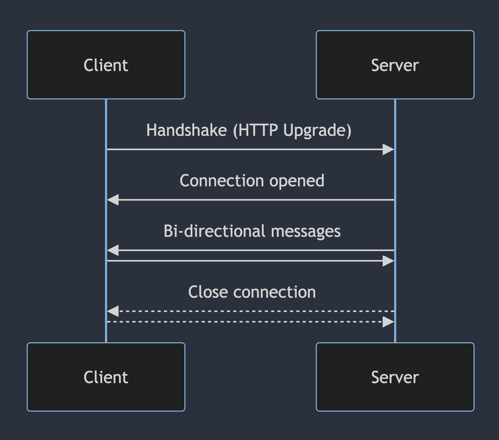

Real-time applications have always fascinated me. The idea that you can connect
people from all over the world in a single web application to chat, edit files,
or play games with near instant feedback is simply amazing. Having very little
experience with what goes into building real-time applications I was interesting
in re-building a key feature of collaboration within Figma: multiplayer cursors.

While this feature may seem relatively simple given the result is just some
cursors that move around on the screen, the implementation requires a
non-trivial amount of code to build. To get started with building our
application, let's first outline the main requirements for the project:

- Low-latency updates between connected users
- Cursors are added when new users connect to the application
- Cursors are removed when users disconnect from the application
- When a user connects, they immediately see all the users who are currently
  connected
- The client automatically reconnects to the server if the connection is
  unexpectedly closed

A very naive approach to this problem would be to use a polling technique where
the client periodically sends it's cursor position to the server and receives
the positions of other connected users. This would result in a great deal of lag
due to the polling delay as well as the time required for each HTTP request.
[WebSockets](https://developer.mozilla.org/en-US/docs/Web/API/WebSockets_API)
are much better suited for this application, but they are more complex to
implement. Before we dive into the implementation, let's understand how
WebSockets work.

## Introduction to WebSockets

