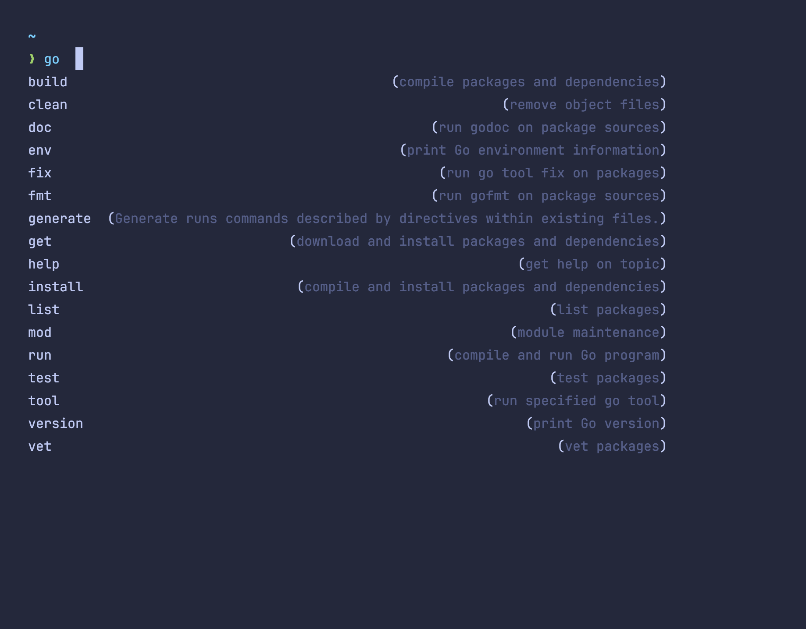
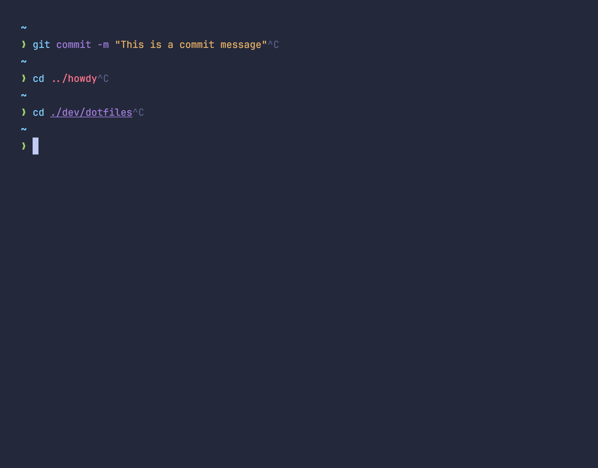

The [Fish shell](https://fishshell.com) is not the most popular shell by
any means. While it does make the top three, it's usage is still
significantly lower than the big two: bash and zsh. However, for the right
person, Fish is a fantastic choice for a shell with lots of nice
improvements that make working in the terminal a pleasure. Let's talk
through some of my favorite features, as well as some of the pain points
and criticisms I have for Fish.

## Autocompletion

While other shells have autocompletion support with the right set of
plugins or configuration, Fish includes it out of the box and it works very
well. You can cycle through candidate options when pressing <kbd>Tab</kbd>,
but Fish also shows you predictive suggestions as you type based on your
shell history, making it dead simple to execute commands repeatedly.

Let's see a few examples!




Fish has a huge library of completions for common tools and many tools
these days that provided completion generation commands (e.g.
`gh completion`) support Fish completions.

## Vim mode

For non-Vim users this one isn't that big of a deal, but for me it's a game
changer. Fish has the ability to configure Vim style keyboard shortcuts to
turn your terminal into a mini version of Vim, allowing you to switch
between insert and normal mode, making it super simple to move around and
edit a command you are working on. Also, it's all just keybindings so you
can even customizing it yourself with your own keybindings for specific
modes. Here are a few of my favorites:

```bash
# Use _ to go to the beginning of the line as I use this a lot in Vim
bind -s --preset _ beginning-of-line
bind -s --preset -M visual _ beginning-of-line

# Switch between modes with escape. A little out of the ordinary, but I find
# myself doing it a lot. Also updates escape in insert mode to not move
# backwards one character.
bind -s --preset \e "set fish_bind_mode insert; commandline -f repaint-mode"
```

## Syntax highlighting

Another feature that I love about Fish is command syntax highlighting. Not
because it makes the output in my terminal more pretty, but rather because
it helps me catch mistakes more easily. When the color of a file path or
command changes from red to blue, I know I'm typing a valid command,
helping me catch mistakes early before running the command. Also, having
commands, arguments, and strings distinguished with different colors does
help when scanning through terminal history to quickly understand a command
that was run.



## The bad parts

One of the big selling points of fish I have yet to talk about, and that is
the scripting language. The reason I waited to mention it is that I don't
actually think it's a selling point of Fish. Let me explain why.

On the one hand, the Fish language is a very well designed shell language
that much more resembles other languages without as many of the odd ways of
writing programs that you might find in Bash scripts. Sadly though, this
results in Fish programs being difficult to share with others. If I write a
script in Fish and share it with my coworkers, many of whom probably don't
use Fish, then they won't be able to use it. Additionally, many tutorials,
StackOverflow answers, or other online resources for shell scripting will
not apply as they are more than likely written in Bash rather than Fish.

I should also mention that I'm not saying this out of complete ignorance. I
did for a while really try to lean into writing scripts in Fish, but I was
constantly frustrated with having to recreate answers or other useful
utilities I found that it became far more work that it was worth. So, while
I do like the language from a theoretical standpoint, practically it
doesn't do the job for me.

## Conclusion

Shells help us get work done while in the terminal. Some use them more than
others, and most people who spend a lot of time in their terminal have some
strong opinions about the best shell to use. While I definitely not so tied
to Fish that I would spend hours debating that it is what you should use, I
do find it helpful for my workflow and would encourage you to give it a try
if you haven't tried it before!
